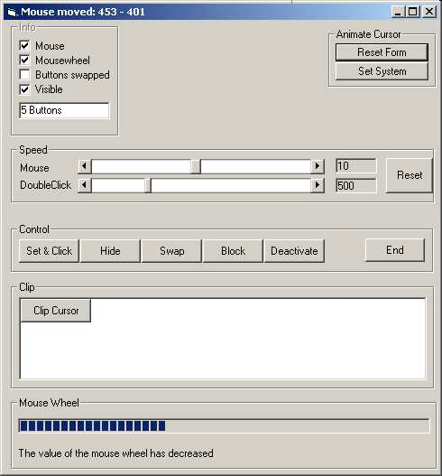



## Mouse Function Class v 2

### Description

Now contains ability to trace mouse wheel events (Get value, direction). Other functions: Trap cursor, place & click automatically, hide cursor, swap butons, block mouse, deactivate mous, change mouse and double click speeds, gather Mouse information, change cursor icon system wide,...
 
### More Info
 

             |
---                |---
**Submitted On**   |2004-03-07 08:05:24
**By**             |[Cyber Chris](https://github.com/Planet-Source-Code/PSCIndex/blob/master/ByAuthor/cyber-chris.md)
**Level**          |Intermediate
**User Rating**    |5.0 (20 globes from 4 users)
**Compatibility**  |VB 3\.0, VB 4\.0 \(16\-bit\), VB 4\.0 \(32\-bit\), VB 5\.0, VB 6\.0
**Category**       |[Windows API Call/ Explanation](https://github.com/Planet-Source-Code/PSCIndex/blob/master/ByCategory/windows-api-call-explanation__1-39.md)
**World**          |[Visual Basic](https://github.com/Planet-Source-Code/PSCIndex/blob/master/ByWorld/visual-basic.md)
**Archive File**   |[Mouse\_Func171715372004\.zip](https://github.com/Planet-Source-Code/cyber-chris-mouse-function-class-v-2__1-52199/archive/master.zip)

